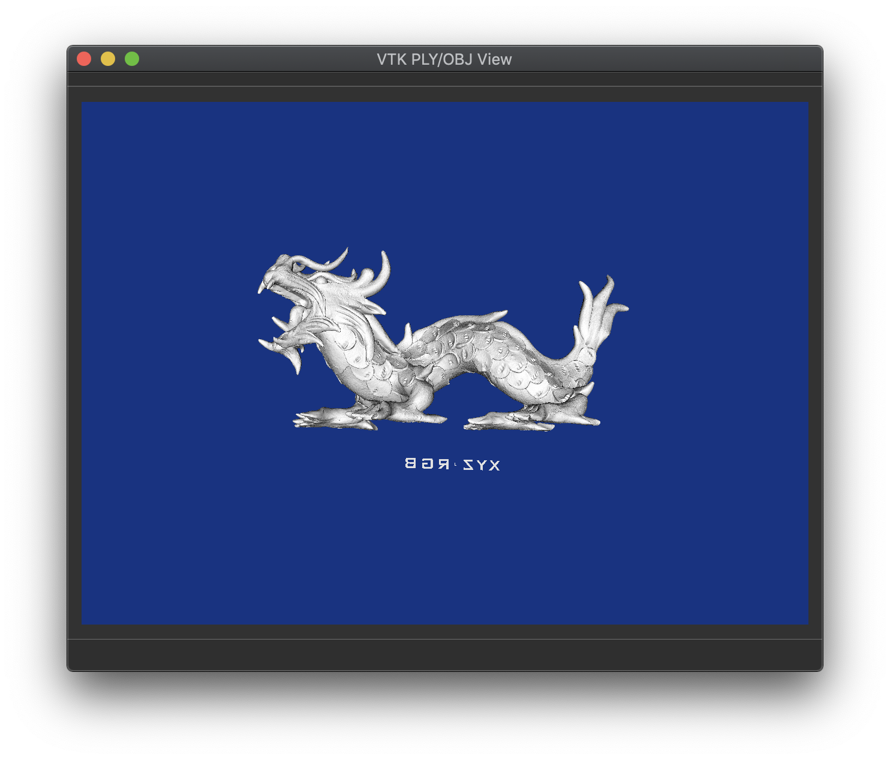

# Solid View a basic VTK/Qt5 example
This is a Qt5 based application intended to open and display .ply, .obj or .vtp
file types.

You can also export .ply or .obj files to .vtp format, which can be opened with
other VTK based applications (i.e. Paraview)




You can get example this .ply file and more from [Stanford 3D Scanning Repository](http://graphics.stanford.edu/data/3Dscanrep/)

Regards
Patricio

# Requirements
This application requires VTK 7.x or above and Qt5.

Initially this app was developed on Linux (Fedora 29) with Qt 5.9 and VTK 7.1.
It has been tested in MacOS with VTK 8.1 and Qt 5.12.

# Building
Clone the Solid View repo on your machine and change directory:

```
git clone https://github.com/papalma/solid_view.git
cd solid_view
```

Create a build directory:
```
mkdir build
cd build
```

Run configure and build the app into a build directory:
```
qmake ../vtkopenfile.pro
make
````

Launch the application. In linux:
```
./vtkopenfile
```

To lauch the app in Mac:
```
open vtkopenfile.app
```


